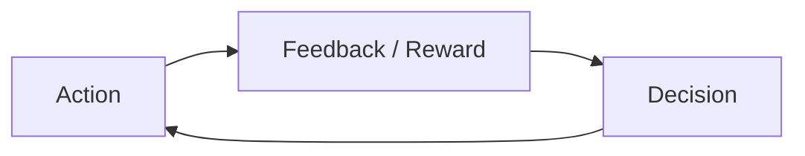

# Core Loop

```mermaid
flowchart LR
    A[Action] --> B[Feedback / Reward]
    B --> C[Decision]
    C --> A
```

## Moment-to-moment (seconds)
- 

## Short loop (minutes)
- 

## Long loop (session)
- 

## What makes it fun?
- 

Back to [[Game Design Document]]
